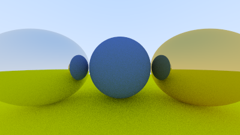

# `ray-tracing`

<p align="center">
    
</p>

Esse projeto de computação gráfica visa implementar um sistema simples, escrito em `C++`(necessário `C++17` para cima, pois algumas partes do programa utilizam `std::filesystem`), de _ray tracing_, uma técnica de renderização que simula os raios de luz (que são tratados como vetores) em objeto, de forma que o observador age como a fonte de luz do ambiente emulado. 

### Compilando

O código fonte pode ser convertido em binário utilizando a ferramenta `cmake`, disponível para Windows, MacOS e distribuições GNU/Linux, para distros baseada em Debian, o `cmake` pode ser obtido por

``` sh
sudo apt install cmake
```

Esse programa utiliza a suite de testes unitários da Google: `gtest`, o `cmake` irá baixar uma cópia dos arquivos necessários para a compilação ocorrer sem problemas. É possível compilar o `gtest` manualmente [seguindo as instruções dadas pela Google](https://github.com/google/googletest/blob/main/googletest/README.md).

Se o sistema atender as duas especificações, pode-se dar inicio ao processo de compilação. 

1. Clone esse repositório

``` sh
git clone git@github.com:mickael-lima/ray_tracing.git
```


2. Crie uma pasta chamada `build` para comportar os arquivos de compilação do `cmake`

``` sh
cd ray_tracing && mkdir -p build
```


3. Entre na pasta `build` e execute o `cmake` apontando para pasta parente, que contém o `CMakeLists.txt`

``` sh
cd build && cmake .. && make
```

4. Quando o processo de compilação terminar, dois binários serão disponibilizados na pasta `build`, chamados de `ray_tracing` e `tests`. O primeiro é o programa em si e o segundo executa uma série de testes para garantir que o código esteja funcionando conforme fora pensado durante sua criação. Para formar a imagem, utilize 

``` sh
./ray_tracing --output nome_da_imagem.ppm
```

### Compatibilidade
O código e o sistema de compilação foram testados no `GNU/Linux` na distribuição `NixOS` em seu `branch stable-24.05` com `cmake v3.29` com auxiliar `gnumake`, no `Windows 11` com a suite `Visual Studio 2022` e em uma máquina virtual com `Ubuntu 22.04 LTS`. As imagens geradas pelo programa foram abertos com o visualizador de bitmap nativo do `Windows 11` e com o `Gwenview` do `KDE 6`. Caso haja alguma complicação em algum sistema não testado (Mac, *BSD) comunique criando um `issue`.
